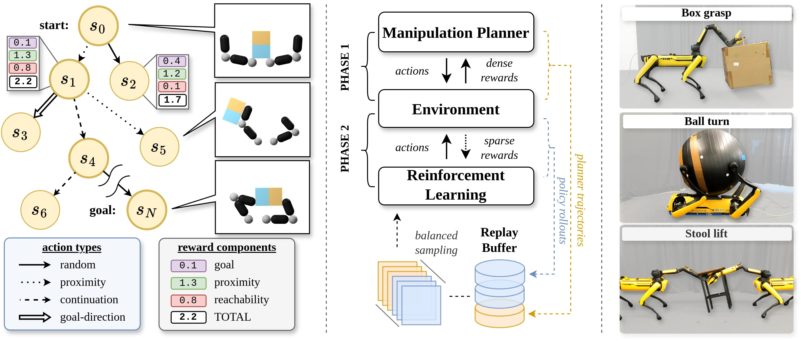

.. image:: _static/images/logo-light.svg
   :width: 400
   :align: center
   :alt: jacta-manipulation
   :class: only-light

.. image:: _static/images/logo-dark.svg
   :width: 400
   :align: center
   :alt: jacta-manipulation
   :class: only-dark


# jacta-manipulation

<!-- prettier-ignore-start -->

.. toctree::
   :caption: API Reference
   :maxdepth: 10
   :hidden:
   :titlesonly:
   :glob:


   api/common/index
   api/learning/index
   api/planner/index
   api/visualizers/index


.. toctree::
   :caption: Documentation
   :hidden:
   :maxdepth: 1
   :titlesonly:

   docs


|build| |nbsp| |docs| |nbsp| |coverage|

.. |build| image:: https://github.com/bdaiinstitute/jacta-manipulation/actions/workflows/build.yml/badge.svg
   :alt: Build status icon
   :target: https://github.com/bdaiinstitute/jacta-manipulation
.. |docs| image:: https://github.com/bdaiinstitute/jacta-manipulation/actions/workflows/docs.yml/badge.svg
   :alt: Docs status icon
   :target: https://github.com/bdaiinstitute/jacta-manipulation
.. |coverage| image:: https://codecov.io/gh/bdaiinstitute/jacta-manipulation/graph/badge.svg?token=7A0OJ37JRF
   :alt: Test coverage status icon
   :target: https://github.com/bdaiinstitute/jacta-manipulation
.. |nbsp| unicode:: 0xA0
   :trim:


<!-- prettier-ignore-end -->

## Jacta: A Versatile Planner for Learning Dexterous and Whole-body Manipulation

[](https://arxiv.org/pdf/2408.01258)
[](https://jacta-manipulation.github.io/)
[](https://rai-inst.com/resources/papers/jacta-a-versatile-planner-for-learning-dexterous-and-whole-body-manipulation/)


Robotic manipulation is challenging and data-driven approaches typically require large amounts of data or expert demonstrations. Therefore, we introduce a motion planner for dexterous and whole-body manipulation tasks. The planner's demonstrations can directly be used by reinforcement learning. With this approach, we can efficiently learn policies for complex manipulation tasks, where traditional reinforcement learning alone only makes little progress.




### Installation
Install cmake
```
sudo apt install cmake
```

Install mujoco-extensions
```
git clone https://github.com/bdaiinstitute/jacta-manipulation.git
cd jacta-manipulation
pip install src/mujoco-extensions -vv
```

Install jacta-manipulation
```
pip install -e .
```


### Getting started
```
cd jacta-manipulation
python jacta-manipulation/examples/planner/example_notebook.py
```


### Citation
```
@inproceedings{brudigam2024jacta,
  author       = {Br{\"u}digam, Jan and Abbas, Ali-Adeeb and Sorokin, Maks and Fang, Kuan and Hung, Brandon and Guru, Maya and Sosnowski, Stefan and Wang, Jiuguang and Hirche, Sandra and Le Cleac'h, Simon},
  editor       = {Agrawal, Pulkit and Kroemer, Oliver and Burgard, Wolfram},
  title        = {Jacta: {A} Versatile Planner for Learning Dexterous and Whole-body Manipulation},
  booktitle    = {Conference on Robot Learning, 6-9 November 2024, Munich, Germany},
  series       = {Proceedings of Machine Learning Research},
  volume       = {270},
  pages        = {994--1020},
  publisher    = {{PMLR}},
  year         = {2024},
  url          = {https://proceedings.mlr.press/v270/bruedigam25a.html},
}
```

### Run tests locally
In the virtual environment:
```
pip install -e .[dev]
python -m pytest
```
you might have to
```
unset PYTHONPATH
```
